# Tools needed

## Visual Studio Code Installation

Download Vscode: Go to [vscode](https://code.visualstudio.com/)

- On the web page click "Download for Windows" if you are using windows system

- Run Installer: Locate the download.exe file

-Click the next through the installation

-Click on install to complete the installation

- open the start menu or use the desktop shortcut 

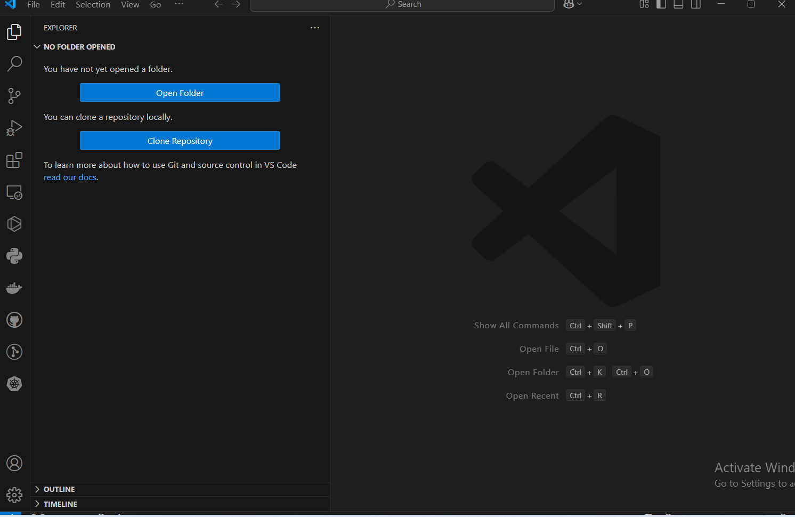

-If your installation is successfull you will have the followingpage shown

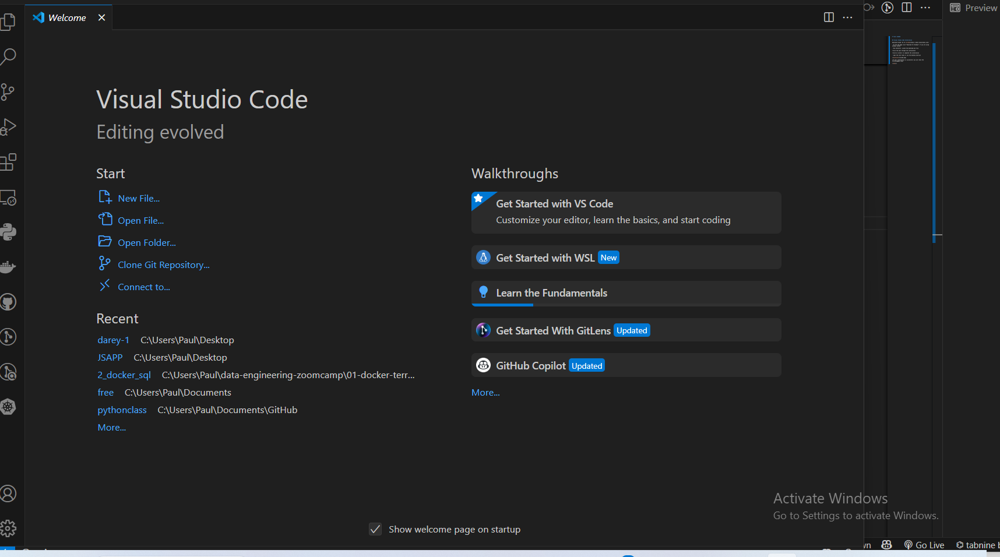

#### Ubuntu

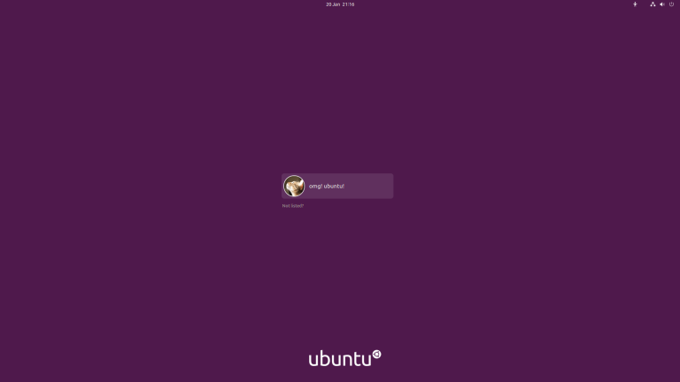

## Git 

#### Windows Installation

On the web page select "Download for Windows" to download The Git installer

Download for Windows [git](https://git-scm.com/downloads/win)

-Locate the download.exe file Double click to run the installer

-Use Git from the windows command prompt""Use the openSSl library."Checkout as -is, commit as-is."use windows' default console window"

-click install to complete the installation open the start menu and to launch the git

If yourinstallation is successful, it will have the following look after launching
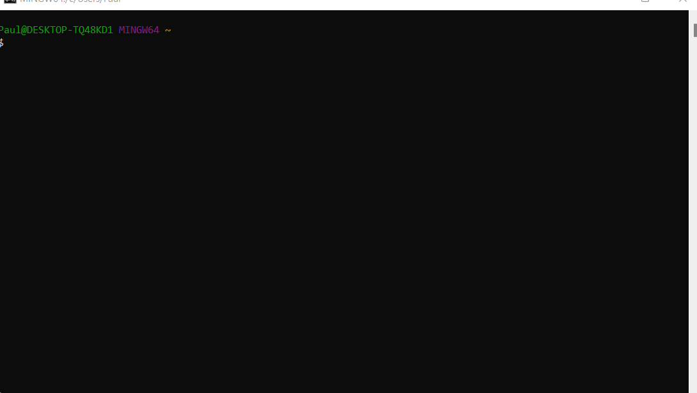

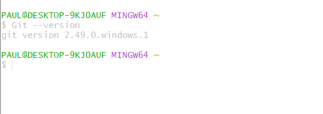

##### Github

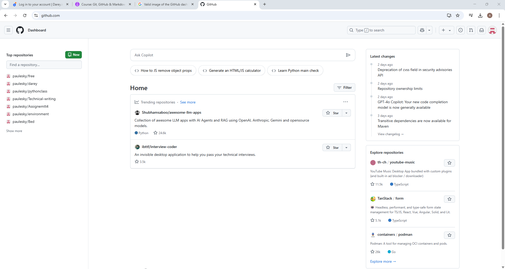

### Windows Installation:

* Download Virtual Box: [oracle VirtualBox](https://www.virtualbox.org/)

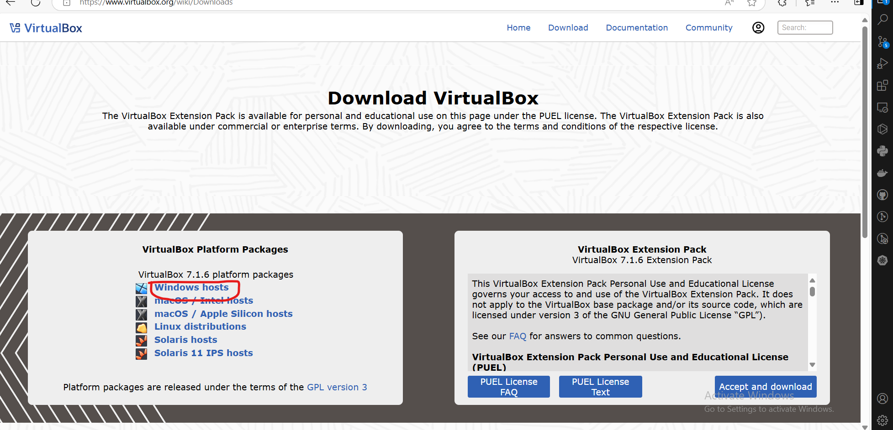

* On the web page select download and click on the windows Host.
* Locate The .exe file double click to run the installer.
* Click next through the installation wizard. click next to all the remaining prompt, leave every option to default.
* Finally, click install to complete the installation.Once completed click on finish to complete the installation
* Open tha start menu and type Virtual box.

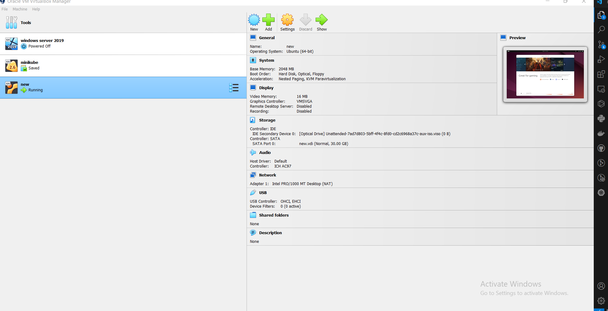
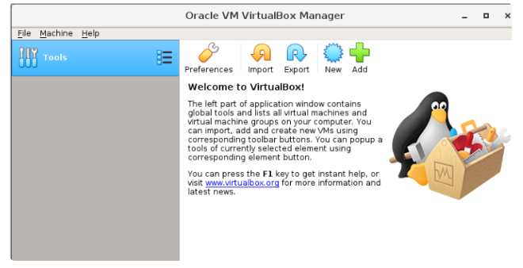

#### Ubuntu on VirtualBox(windows Host)

* Download Ubuntu ISO file: Go to the [Ubuntu Official Website](https://ubuntu.com/download/desktop)

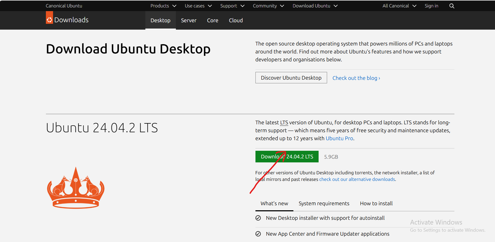

* Launch your already install virtual box

* To create a new VM, click on NEW or plus sysmbol at the top center of the virtual box window.

* Choose Linux as the type, and ubuntu as the version. Allocate at least @GB of RAM for the virtual Machine, Create a virtual hard disk, Choosing either dynamic or fixed size,"dynamic" recommended

* Choose the ubuntu .iso file That you downloaded from ubuntu [website](https://ubuntu.com/download/desktop)

* Launch The virtual machine andstart the ubuntu installation process.

* Follow the on-screen instruction to install ubuntu, configuring language,Keyboard,User acount etc.

* Remove the installation media when prompted, the power off the virtual machine, and ubuntu will boot to desktop as shown below , the you can enter the login credentials you created during installation.ubuntu will boot to desktop as shown below, then you can enter the login credentials you created during installation

##### AWS INSTALLATION

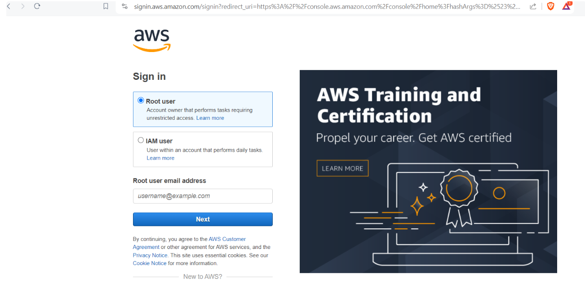
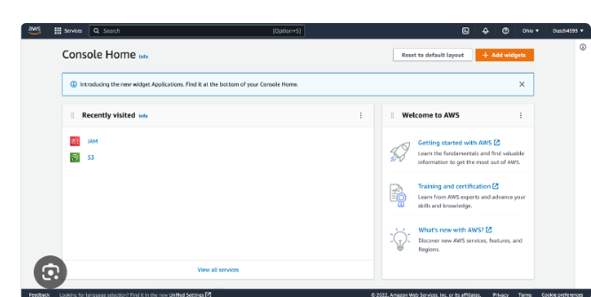

